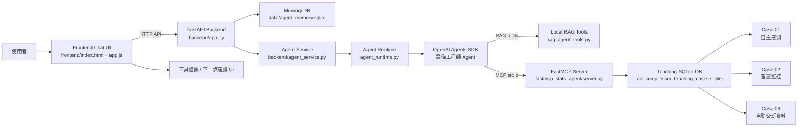
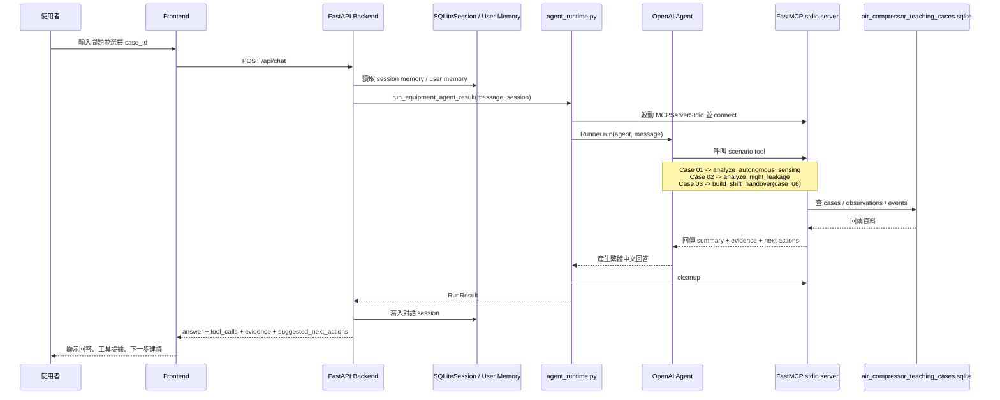
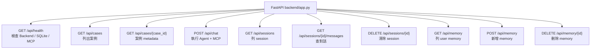

# FastMCP SQLite Agent Architecture

## 整體架構



## 一次聊天請求順序



## Backend API 路由



## 主要檔案

- `frontend/index.html`：聊天介面 HTML。
- `frontend/app.js`：呼叫 backend API、渲染訊息、工具證據與 memory。
- `frontend/style.css`：聊天介面樣式。
- `backend/app.py`：FastAPI app 與 API routes。
- `backend/agent_service.py`：封裝 chat request、memory context、agent run 與 evidence 回傳。
- `backend/memory.py`：session memory 與 user memory SQLite helper。
- `backend/schemas.py`：API request / response schemas。
- `backend/settings.py`：專案路徑、SQLite DB path、frontend root。
- `agent_runtime.py`：建立 OpenAI Agents SDK agent 與 `MCPServerStdio` bridge。
- `main.py`：CLI 單次執行 agent 的入口。
- `curated_fastmcp_sqlite_teaching_case/fastmcp_stats_agent/server.py`：FastMCP tools 與 SQLite scenario analysis。
- `curated_fastmcp_sqlite_teaching_case/data/air_compressor_teaching_cases.sqlite`：教學案例資料庫。

## Case 對應

| UI/任務 | Backend case_id | SQLite 實際資料 | MCP scenario tool |
| --- | --- | --- | --- |
| Case 01 自主感測 | `case_01` | `case01_sensor_observations` | `analyze_autonomous_sensing` |
| Case 02 智慧監控 | `case_02` | `case02_monitoring_observations` | `analyze_night_leakage` |
| 案例 3 自動交班 | `case_03` alias | `case_06` / `case06_logbook_observations` | `build_shift_handover` |

## 啟動方式

```bash
./.venv/bin/uvicorn backend.app:app --host 127.0.0.1 --port 8000
```

開啟：

```text
http://127.0.0.1:8000
```

